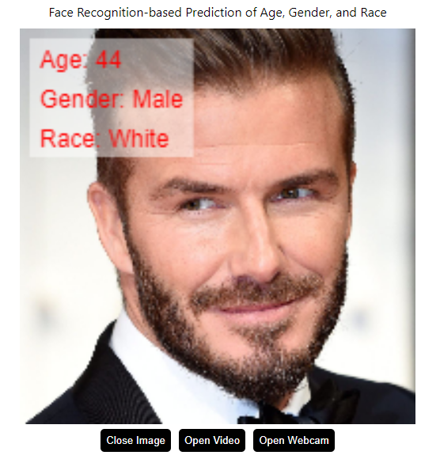
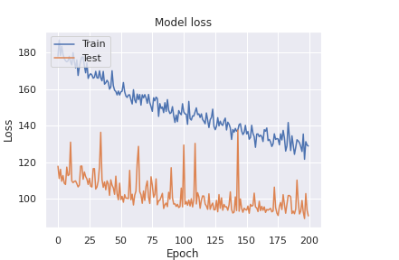

# 🤖 Gesichtserkennungsbasierte Vorhersage von Alter, Geschlecht und Rasse
# Face Recognition-based Prediction of Age, Gender, and Race

<p align="center">
  
</p>


---

Über den folgenden Link können Sie Ihre Bilder oder Videos direkt hochladen und testen, sogar Live-Videos von Ihrer Kamera können getestet werden.

Through the link below, you can directly upload and test your images or videos, even test video streams from your camera.

##https://miaoima.github.io/FaceAttributesPredictor/

---


#### Projektbeschreibung

#### Projekt Hintergrund
In diesem Projekt zielen wir darauf ab, ein Modell zu erstellen, das in der Lage ist, das Alter, Geschlecht und die Rasse einer Person aus ihren Bildmerkmalen in einem Bild vorherzusagen. Die Grundlage des Projekts ist der UTKFace-Datensatz, der über 20.000 Gesichtsbilder mit einem Altersbereich von 0 bis 116 Jahren enthält.

#### Tiefgreifende Diskussion über Daten Vorverarbeitung
In diesem Abschnitt haben wir strenge Vorverarbeitung und Bereinigung des Datensatzes durchgeführt. Insbesondere bei der Verteilung von Alter und Rasse haben wir festgestellt, dass es einige Ungleichgewichte gibt. Zum Beispiel gibt es deutlich mehr Bilder im Alter zwischen 22 und 25 Jahren und auch mehr Bilder von Weißen. Um zu verhindern, dass das Modell diese Kategorien bevorzugt, haben wir eine angemessene Datenbalancierung durchgeführt, indem wir zufällig einige Proben aus diesen Kategorien gelöscht haben. Gleichzeitig haben wir uns aufgrund der geringen Anzahl von Proben dazu entschieden, Daten von Personen über 80 Jahren zu ignorieren.
<p align="center">
  
</p>

<p align="center">
  
</p>

<p align="center">
  
</p>

#### Modellbau und Analyse
In Bezug auf den Modellaufbau haben wir uns für eine relativ einfache CNN-Struktur als unser Grundmodell entschieden. Die spezifische Modellarchitektur ist wie folgt:
```python
agemodel = Sequential()
agemodel.add(Conv2D(32, (3,3), activation='relu', input_shape=(200, 200, 3)))
agemodel.add(MaxPooling2D((2,2)))
agemodel.add(Conv2D(64, (3,3), activation='relu'))
agemodel.add(MaxPooling2D((2,2)))
agemodel.add(Conv2D(128, (3,3), activation='relu'))
agemodel.add(MaxPooling2D((2,2)))
agemodel.add(Flatten())
agemodel.add(Dense(64, activation='relu'))
agemodel.add(Dropout(0.5))
agemodel.add(Dense(1, activation='relu'))
```
Wir haben bewusst keine beliebten Modelle wie ResNet, DenseNet oder VGG verwendet, da sie viele Parameter enthalten und daher eine lange Trainingszeit benötigen, was auf Plattformen mit begrenzten Ressourcen, wie Kaggle, nicht praktikabel ist.
<p align="center">
  
</p>

#### Herausforderungen und Analyse des Modells
Obwohl unser Modell in gewissem Maße die Vorhersageziele erreicht hat, erkennen wir durch Beobachtung der Loss-Veränderung, dass es noch erheblichen Verbesserungsbedarf gibt und es noch weit von der Optimierung entfernt ist. Im Vergleich zu anderen fortschrittlichen Modellen, wie DeepFace, gibt es immer noch eine erhebliche Lücke in Bezug auf Vorhersagegenauigkeit und Stabilität unseres Modells.

#### Projektausblick
In zukünftigen Arbeiten planen wir, fortschrittlichere und reife Modelle wie DeepFace zu verwenden und zu erforschen, wie sie auf der React-Plattform für die Echtzeitvorhersage von Alter, Geschlecht und Rasse für mehrere Personen implementiert werden können, um die Praktikabilität und Benutzererfahrung unseres Modells weiter zu verbessern. 

Auf dieser Grundlage hoffen wir, dass dieses Projekt zu einer offenen Plattform werden kann, die nicht nur auf die Vorhersage von Alter, Geschlecht und Rasse beschränkt ist. In der Zukunft könnte es auf weitere Gesichtsmerkmalsanalysen, wie Emotionserkennung, Gesichtserkennung usw., erweitert werden, um den Benutzern mehr Dienstleistungen und Bequemlichkeiten zu bieten.

Natürlich, hier ist die Anleitung auf Deutsch:

---
#### .h5 >>> js

Um ein Modell im `.h5` Format in ein von TensorFlow.js nutzbares Format zu konvertieren und es mit `tf.loadGraphModel` zu laden, folgen Sie diesen Schritten. In diesem Fall wird das Modell im GraphModel-Format konvertiert.

### Schritt 1: Installieren Sie den TensorFlow.js Konverter
Stellen Sie sicher, dass Sie den Python-Konverter für TensorFlow.js installiert haben. Führen Sie den folgenden Befehl in Ihrem Terminal oder Command Prompt aus:
```bash
pip install tensorflowjs
```

### Schritt 2: Modell konvertieren
Verwenden Sie den TensorFlow.js Konverter, um Ihr `.h5` Modell in das GraphModel-Format zu konvertieren. Führen Sie den folgenden Befehl in Ihrem Terminal oder Command Prompt aus:
```bash
tensorflowjs_converter --input_format keras \
                       --output_format tfjs_graph_model \
                       pfad_zu_Ihrem_model.h5 \
                       pfad_zum_ausgabe_verzeichnis/
```
Dabei steht:
- `pfad_zu_Ihrem_model.h5` für den Pfad zu Ihrer `.h5` Modell-Datei.
- `pfad_zum_ausgabe_verzeichnis/` für den Pfad zum Verzeichnis, in dem die konvertierten Modell-Dateien gespeichert werden sollen.

### Schritt 3: Überprüfen Sie die Modell-Dateien
In Ihrem Ausgabeverzeichnis `pfad_zum_ausgabe_verzeichnis/` sollten Sie nun eine `model.json` Datei sowie mehrere binäre Gewichtsdateien (`*.bin` Dateien) sehen.

### Schritt 4: Modell-Dateien bereitstellen
Die konvertierten Modell-Dateien (`model.json` und `*.bin` Dateien) müssen auf einem Webserver bereitgestellt werden, damit sie in Ihrem TensorFlow.js Projekt zugänglich sind.

### Schritt 5: Modell in TensorFlow.js laden
In Ihrem TensorFlow.js Code laden Sie das Modell mit der `tf.loadGraphModel` Funktion:
```javascript
const model = await tf.loadGraphModel('url_zu_Ihrem_model/model.json');
```
Hierbei steht `url_zu_Ihrem_model/model.json` für die URL zu Ihrer bereitgestellten `model.json` Datei.

### Schritt 6: Modell nutzen
Jetzt können Sie das Modell für Vorhersagen verwenden:
```javascript
const vorhersage = model.execute(inputTensor);
```
Hierbei ist `inputTensor` ein TensorFlow.js Tensor, der den Eingabeanforderungen des Modells entspricht.

Sie sollten jetzt in der Lage sein, Ihr Modell in Ihrem TensorFlow.js Projekt zu verwenden! 


